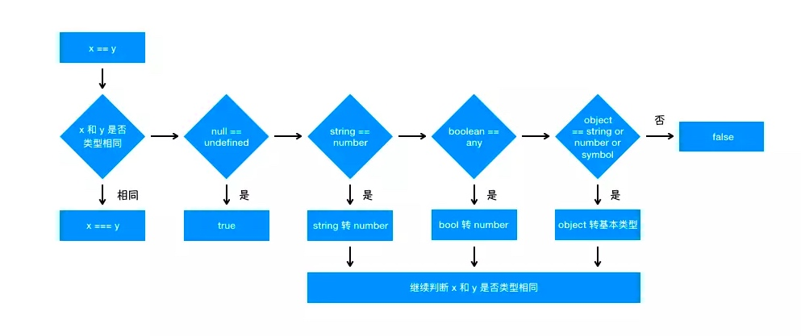
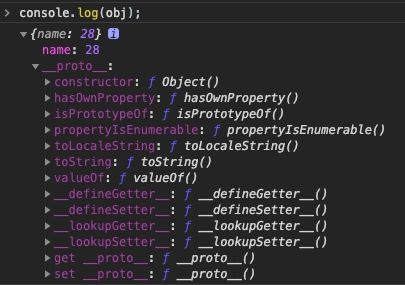
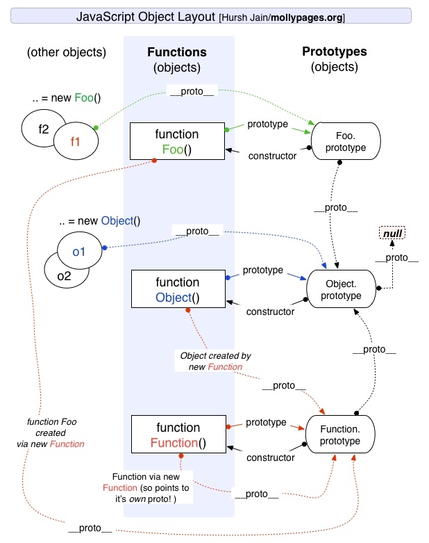

## == vs ===

对于 `==` 来说，如果对比双方的类型不一样的话，就会进行类型转换。

假如我们需要对比 `x` 和 `y` 是否相同，就会进行如下判断流程：

1.首先会判断两者类型是否相同。相同的话就是比大小了
2.类型不相同的话，那么就会进行类型转换
3.会先判断是否在对比 `null` 和 `undefined`，是的话就会返回 `true`
4.判断两者类型是否为 `string` 和 `number`，是的话就会将字符串转换为 `number`

```
1 == '1'
      ↓
1 ==  1

```

5.判断其中一方是否为 `boolean`，是的话就会把 `boolean` 转为 `number` 再进行判断

```
‘1’ == true
        ↓
‘1’ ==  1
        ↓
 1  ==  1
```
6.判断其中一方是否为 `object` 且另一方为 `string`、`number` 或者 `symbol`，是的话就会把 `object` 转为原始类型再进行判断

```
‘1’ == { name: ‘yck’ }
        ↓
‘1’ == ‘[object Object]’

```

可参考流程图：



当然了，这个流程图并没有将所有的情况都列举出来，我这里只将常用到的情况列举了，如果你想了解更多的内容可以参考 标准文档。

对于 `===` 来说就简单多了，就是判断两者类型和值是否相同。

## 闭包

闭包的定义其实很简单：函数 `A` 内部有一个函数 `B`，函数 `B` 可以访问到函数 `A` 中的变量，那么函数 `B` 就是闭包。

```
function A() {
  let a = 1
  window.B = function () {
      console.log(a)
  }
}
A()
B() // 1
```
很多人对于闭包的解释可能是函数嵌套了函数，然后返回一个函数。其实这个解释是不完整的，就比如我上面这个例子就可以反驳这个观点。

在 `JS` 中，闭包存在的意义就是让我们可以间接访问函数内部的变量。

> 举例:循环中使用闭包解决 `var` 定义函数的问题

```
for (var i = 1; i <= 5; i++) {
  setTimeout(function timer() {
    console.log(i)
  }, i * 1000)
}
```
首先因为 `setTimeout` 是个异步函数，所以会先把循环全部执行完毕，这时候 `i` 就是 `6` 了，所以会输出一堆 `6`。

解决办法有三种，第一种是使用闭包的方式

```
for (var i = 1; i <= 5; i++) {
  ;(function(j) {
    setTimeout(function timer() {
      console.log(j)
    }, j * 1000)
  })(i)
}
```
在上述代码中，我们首先使用了立即执行函数将 `i` 传入函数内部，这个时候值就被固定在了参数 `j` 上面不会改变，当下次执行 `timer` 这个闭包的时候，就可以使用外部函数的变量 `j`，从而达到目的。

第二种就是使用 `setTimeout` 的第三个参数，这个参数会被当成 `timer` 函数的参数传入。

```
for (var i = 1; i <= 5; i++) {
  setTimeout(
    function timer(j) {
      console.log(j)
    },
    i * 1000,
    i
  )
}
```
第三种就是使用 `let` 定义 `i` 了来解决问题了，这个也是最为推荐的方式

```
for (let i = 1; i <= 5; i++) {
  setTimeout(function timer() {
    console.log(i)
  }, i * 1000)
}
```

## 深浅拷贝


我们之前了解了对象类型在赋值的过程中其实是复制了地址，从而会导致改变了一方其他也都被改变的情况。通常在开发中我们不希望出现这样的问题，我们可以使用浅拷贝来解决这个情况。

```
let a = {
  age: 1
}
let b = a
a.age = 2
console.log(b.age) // 2
```
### 浅拷贝

首先可以通过 `Object.assign` 来解决这个问题，很多人认为这个函数是用来深拷贝的。其实并不是，`Object.assign`只会拷贝所有的属性值到新的对象中，如果属性值是对象的话，拷贝的是地址，所以并不是深拷贝。

```
let a = {
  age: 1
}
let b = Object.assign({}, a)
a.age = 2
console.log(b.age) // 1
```
另外我们还可以通过展开运算符 `...` 来实现浅拷贝

```
let a = {
  age: 1
}
let b = { ...a }
a.age = 2
console.log(b.age) // 1
```
通常浅拷贝就能解决大部分问题了，但是当我们遇到如下情况就可能需要使用到深拷贝了

```
let a = {
  age: 1,
  jobs: {
    first: ‘FE’
  }
}
let b = { ...a }
a.jobs.first = ‘native’
console.log(b.jobs.first) // native
```
浅拷贝只解决了第一层的问题，如果接下去的值中还有对象的话，那么就又回到最开始的话题了，两者享有相同的地址。要解决这个问题，我们就得使用深拷贝了。

### 深拷贝
这个问题通常可以通过 `JSON.parse(JSON.stringify(object))` 来解决。

```
let a = {
  age: 1,
  jobs: {
    first: ‘FE’
  }
}
let b = JSON.parse(JSON.stringify(a))
a.jobs.first = ‘native’
console.log(b.jobs.first) // FE
```
但是该方法也是有局限性的：

* 会忽略 undefined
* 会忽略 symbol
* 不能序列化函数
* 不能解决循环引用的对象


```
let obj = {
  a: 1,
  b: {
    c: 2,
    d: 3,
  },
}
obj.c = obj.b
obj.e = obj.a
obj.b.c = obj.c
obj.b.d = obj.b
obj.b.e = obj.b.c
let newObj = JSON.parse(JSON.stringify(obj))
console.log(newObj)
```
如果你有这么一个循环引用对象，你会发现并不能通过该方法实现深拷贝


在遇到函数、 `undefined` 或者 `symbol` 的时候，该对象也不能正常的序列化

```
let a = {
  age: undefined,
  sex: Symbol(‘male’),
  jobs: function() {},
  name: ‘yck’
}
let b = JSON.parse(JSON.stringify(a))
console.log(b) // {name: “yck”}
```
你会发现在上述情况中，该方法会忽略掉函数和 `undefined` 。

但是在通常情况下，复杂数据都是可以序列化的，所以这个函数可以解决大部分问题。

如果你所需拷贝的对象含有内置类型并且不包含函数，可以使用 `MessageChannel`

```
function structuralClone(obj) {
  return new Promise(resolve => {
    const { port1, port2 } = new MessageChannel()
    port2.onmessage = ev => resolve(ev.data)
    port1.postMessage(obj)
  })
}

var obj = {
  a: 1,
  b: {
    c: 2
  }
}

obj.b.d = obj.b

// 注意该方法是异步的
// 可以处理 undefined 和循环引用对象
const test = async () => {
  const clone = await structuralClone(obj)
  console.log(clone)
}
test()
```
当然你可能想自己来实现一个深拷贝，但是其实实现一个深拷贝是很困难的，需要我们考虑好多种边界情况，比如原型链如何处理、`DOM` 如何处理等等，所以这里我们实现的深拷贝只是简易版，并且我其实更推荐使用 `lodash` 的深拷贝函数。

```
function deepClone(obj) {
  function isObject(o) {
    return (typeof o === ‘object’ || typeof o === ‘function’) && o !== null
  }

  if (!isObject(obj)) {
    throw new Error(‘非对象’)
  }

  let isArray = Array.isArray(obj)
  let newObj = isArray ? [...obj] : { ...obj }
  Reflect.ownKeys(newObj).forEach(key => {
    newObj[key] = isObject(obj[key]) ? deepClone(obj[key]) : obj[key]
  })

  return newObj
}

let obj = {
  a: [1, 2, 3],
  b: {
    c: 2,
    d: 3
  }
}
let newObj = deepClone(obj)
newObj.b.c = 1
console.log(obj.b.c) // 2
```

## 原型

当我们创建一个对象时 `let obj = { age: 28 }`，我们可以发现能使用很多种函数，但是我们明明没有定义过它们，对于这种情况你是否有过疑惑？


当我们在浏览器中打印 `obj` 时你会发现，在 `obj` 上居然还有一个 `__proto__` 属性，那么看来之前的疑问就和这个属性有关系了。

其实每个 `JS` 对象都有 `__proto__` 属性，这个属性指向了原型。这个属性在现在来说已经不推荐直接去使用它了，这只是浏览器在早期为了让我们访问到内部属性 `[[prototype]]` 来实现的一个东西。

讲到这里好像还是没有弄明白什么是原型，接下来让我们再看看 `__proto__` 里面有什么吧。



看到这里你应该明白了，原型也是一个对象，并且这个对象中包含了很多函数，所以我们可以得出一个结论：
> 对于 `obj` 来说，可以通过 `__proto__` 找到一个原型对象，在该对象中定义了很多函数让我们来使用。

在上面的图中我们还可以发现一个 `constructor` 属性，也就是构造函数


打开 `constructor` 属性我们又可以发现其中还有一个 `prototype` 属性，并且这个属性对应的值和先前我们在 `__proto__` 中看到的一模一样。所以我们又可以得出一个结论：
> 原型的 `constructor` 属性指向构造函数，构造函数又通过 `prototype` 属性指回原型，但是并不是所有函数都具有这个属性，`Function.prototype.bind()` 就没有这个属性。

接下来我们再来看一张图，来帮助我们更好的理解原型和原型链




看完这张图，我再来解释下什么是原型链吧。其实原型链就是多个对象通过 `__proto__` 的方式连接了起来。为什么 `obj` 可以访问到 `valueOf` 函数，就是因为 `obj` 通过原型链找到了 `valueOf` 函数。

总结起来就是以下几点：

* `Object` 是所有对象的爸爸，所有对象都可以通过 `__proto__` 找到它
* `Function` 是所有函数的爸爸，所有函数都可以通过 `__proto__` 找到它
* 函数的 `prototype` 是一个对象
* 对象的 `__proto__` 属性指向原型， `__proto__` 将对象和原型连接起来组成了原型链

